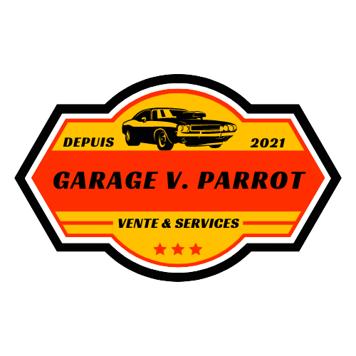

<p align="center">
    <a href="https://garage-vicent-parrot-studi-ecf-2023.netlify.app/">
        
    </a>
</p>
<h1 align="center">
    Garage Vincent Parrot
</h1>

# Welcome on the front-end of the project Garage Vincent Parrot

## 📋 The project
This is the front end of the project. It's a website for a garage. You can see the cars, the services and the contact page. You can also send a message to the garage and see reviews from other customers.

It's a responsive website.
Made with Vite, ReactJS, TailwindCSS, Javascript, React Router, Axios, React Hook Form, Yup, React Hook Form Resolver, Framer-Motion... 

There is a professionnal access for employees and admin to manage the site.
Employees can add, edit and delete cars. They can also see the messages of the customers. They can also read and validate reviews in the order to display them on the website.
Admins can add, edit and delete cars. They can also see the messages of the customers. They can also read and validate reviews in the order to display them on the website. They can also add, edit and delete employees.

## Installation

1. **Clone the repository**

    ```shell
    $ git clone https://github.com/MisterWaner/garage-vincent-parrot-front.git
    ```

2. **Install the dependencies**

    ```shell
    $ npm install
    ```

3. **Start the project**

    ```shell
    $ npm run dev
    ```

## 📅 When ?
This project was done for my final evaluation during my web development studies in 2023.

---
You can find the backend repo of the project [here](https://github.com/MisterWaner/garage-vincent-parrot-back).

You can find the website [here](https://garage-vicent-parrot-studi-ecf-2023.netlify.app/).

